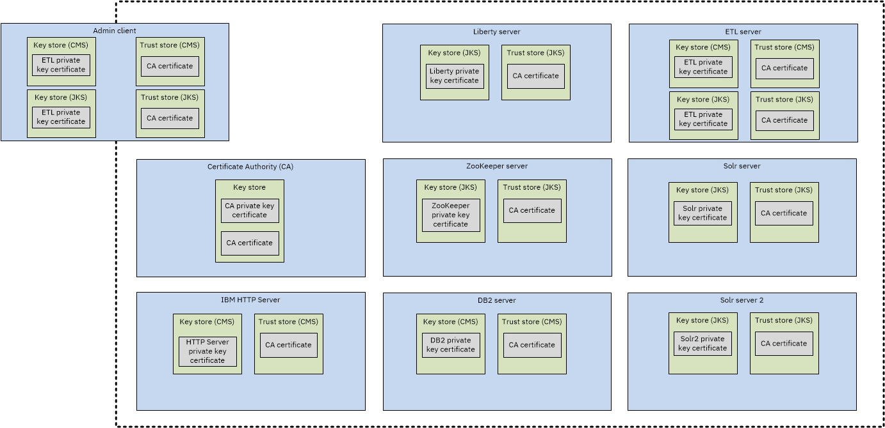

# Keystores and certificates for components of i2 Analyze
SSL communication relies on encryption, keys, and certificates to initiate a secure connection. The certificates are stored in keystore files on the client and the server.

Certificates are exchanged to establish trust during the handshake process that initiates a secure connection. When a certificate is granted through a certificate authority, that certificate can be trusted by the clients or applications that trust certificates that are signed by that authority. A public key certificate that authenticates a server is stored in a keystore file on the server. Trusted certificate authority certificates are stored in the client's truststore file.

As part of the SSL handshake process, certificates are exchanged that are signed by a trusted certificate authority to verify that a certificate is authentic.

For more information about the keystores and certificates that are required in an i2 Analyze deployment, see [SSL certificates for i2 Analyze](https://www.ibm.com/support/knowledgecenter/SSXVTH_latest/com.ibm.i2.eia.go.live.doc/c_ssl_only_intro.html) and [SSL keystores for i2 Analyze](https://www.ibm.com/support/knowledgecenter/SSXVTH_latest/com.ibm.i2.eia.go.live.doc/c_creating_keystores.html).

As part of the distributed deployment example, scripts are provided that demonstrate how to create the required keystores and certificates. The certificates are created and signed by a certificate authority, which is also included as part of the example.

To create the keystores, certificates, and certificate authority, run the `createKeysAndStores` script file.

These scripts contain comments that explain the processes that are completed. As an overview, a certificate authority image is built and run as a certificate authority container. A keystore, truststore, and private key certificate are created for each component of i2 Analyze. A certificate signing request is created for each certificate. Each signing request is sent to the certificate authority, which signs and returns the certificate. At the end of this process, each container contains a keystore that is populated with its signed private key certificate and a truststore that is populated with the certificate authority's signer certificate.

The certificate authority's signer certificate is used to verify the certificates that are received from the other components of i2 Analyze.

After you run the `createKeysAndStores` script, the environment is as follows:

In a non-Docker environment, you must ensure that the correct stores and certificates are in place. You can use the example scripts and information in the IBM Knowledge Center to identify methods for creating the stores.
